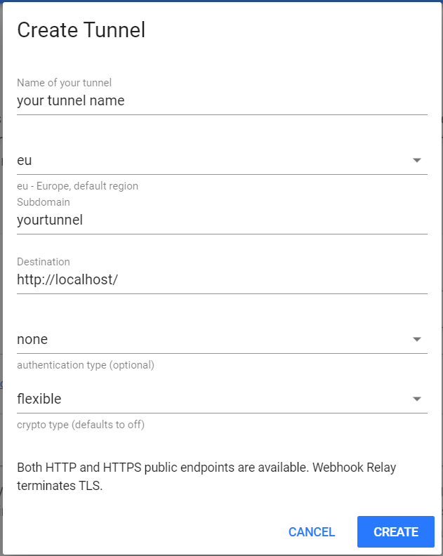

# Drone w/ Web Relay
Run drone locally or remotely with a web relay to access it from anywhere.

This is for small projects that require a CI when you don't want to create infrastructure in the cloud to get up and running.

This project requires [Docker](https://www.docker.com/), a [Webhook Relay](https://my.webhookrelay.com) account, and a [Github](github.com) account.

## Setup
Add required environment variables. If missing from the environment, you will be prompted to enter any missing variables.

| Variable | Description |
| -------- | -------- |
| DRONE_ADMIN | Github user that will be the drone admin |
| DRONE_GITHUB_CLIENT_ID | Github OAuth app client id |
| DRONE_GITHUB_CLIENT_SECRET | Github OAuth app client secret |
| RELAY_KEY | Web Relay access key | 
| RELAY_TOKEN | Web Relay access token | 
| RELAY_HOST | Web relay host url  |

To create the `DRONE_GITHUB_CLIENT_ID` and `DRONE_GITHUB_CLIENT_SECRET` follow the [Github OAuth app instructions](https://developer.github.com/apps/building-oauth-apps/creating-an-oauth-app/).

To create the relay tunnel go to https://my.webhookrelay.com/tunnels like the following:

Replace `tunnel name` and `subdomain` with your tunnel name and subdomain. All of the other fields should match the screenshot. The subdomain will become the prefix to the `RELAY_HOST`. Once the tunnel is created you will see the entire host url in the table.

To create the `RELAY_KEY` and `RELAY_TOKEN` go to https://my.webhookrelay.com/tokens and follow the instructions for creating an access token. Add the name of your tunnel to the access token tunnel whitelist.

## Start Drone with Web Relay
Run `start-drone.sh`.

This will start the drone server and agent. Then it will connect the drone server with the web relay. You should now be able to connect to the drone server using the `RELAY_HOST` url from any device.

## Alternative to Web Relay
If deploying to an ec2 instance the web relay can be ignored if you're planning to use a route 53 alias for the ec2 instance.

